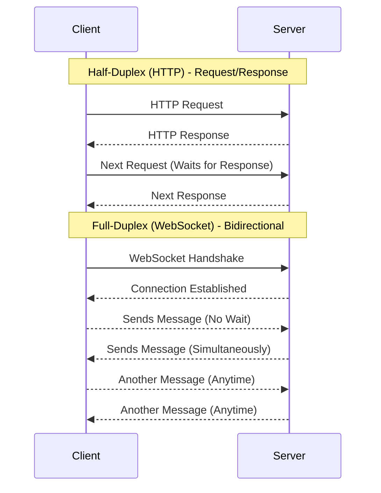

```mermaid
sequenceDiagram
    participant Client
    participant Server

    Note over Client,Server: Half-Duplex (HTTP) - Request/Response
    Client->>Server: HTTP Request
    Server-->>Client: HTTP Response
    Client->>Server: Next Request (Waits for Response)
    Server-->>Client: Next Response

    Note over Client,Server: Full-Duplex (WebSocket) - Bidirectional
    Client->>Server: WebSocket Handshake
    Server-->>Client: Connection Established
    Client-->>Server: Sends Message (No Wait)
    Server-->>Client: Sends Message (Simultaneously)
    Client-->>Server: Another Message (Anytime)
    Server-->>Client: Another Message (Anytime)
```