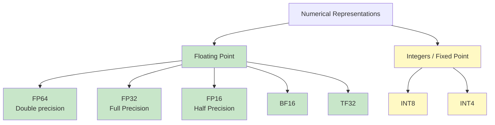

```mermaid
flowchart TD
    A["Numerical Representations"] --> B["Floating Point"] & C["Integers / Fixed Point"]
    B --> 1["FP64<br>Double precision"] & 2["FP32<br>Full Precision"] & 3["FP16<br>Half Precision"] & 4["BF16"] & 5["TF32"]
    C --> C1["INT8"] & C2["INT4"]   

    style B fill:#C8E6C9
    style 1 fill:#C8E6C9
    style 2 fill:#C8E6C9
    style 3 fill:#C8E6C9
    style 4 fill:#C8E6C9
    style 5 fill:#C8E6C9
    style C fill:#FFF9C4
    style C1 fill:#FFF9C4
    style C2 fill:#FFF9C4
```