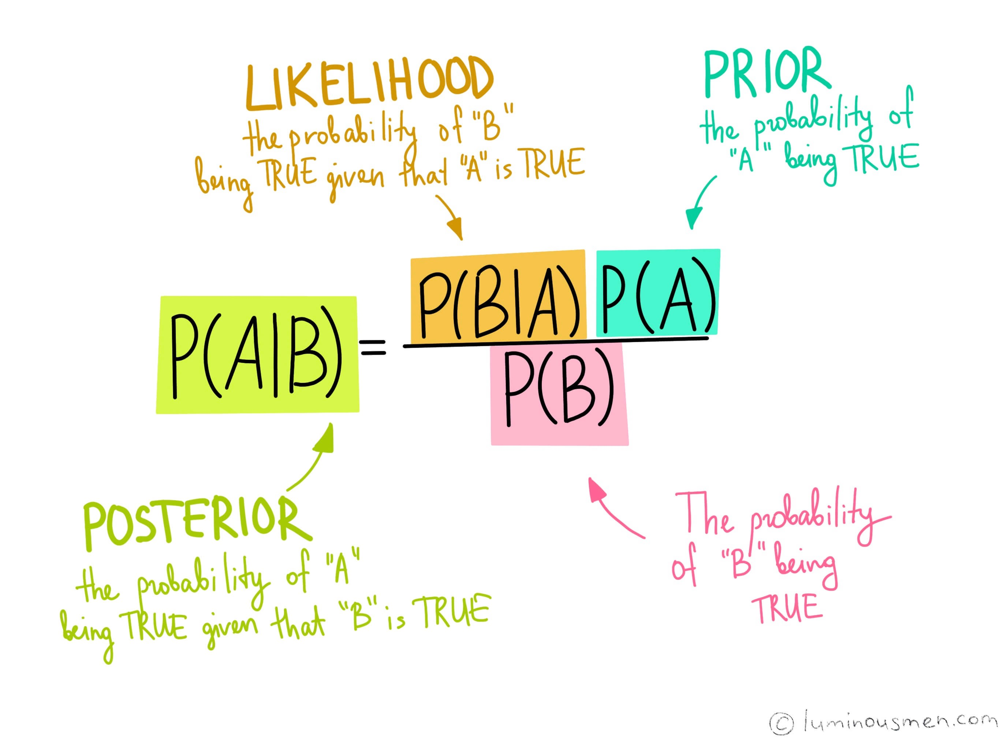

**Bayes Theorem:**

  

**Algorithm Assumptions:**
1) **Bag of Words Assumption**: Position of features doesnt matter
2) **Naive Bayes Assumption**: Conditional Independence assumption that the probabilities are independent given the class C and hence can be naively multiplied 
3) Each feature contributes equally to the outcome

**Smoothing Techniques:**  
  

**Questions:**  
1. How to use Naive bayes in case of continuous values ?
2. What is the relation between Language modelling and naive bayes ?